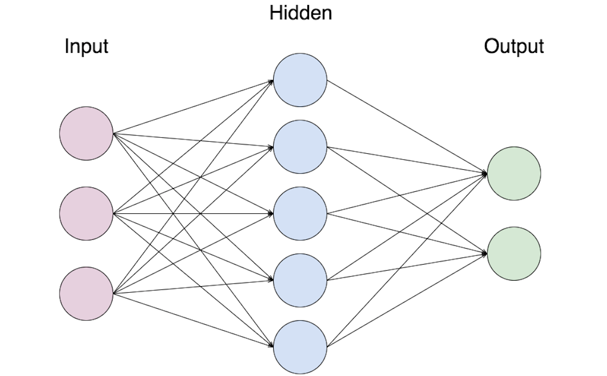

MSSV: 1760290  
Tên: Nguyễn Thanh Dương
# Neural Network
### 1.Giới thiệu về bài toán phân lớp dữ liệu:
Phân lớp (**Classification**) là một trong những bài toán của máy học. Mục tiêu của bài toán phân lớp là huấn luyện (train) máy/mô hình dựa vào dữ liệu huấn luyện (training data). Dự liệu huấn luyện là dữ liệu với các **thông tin mô tả** và **lớp** mà mỗi thông tin đó thuộc về. Với máy/mô hình đã huấn luyện này, khi đưa một thông tin mô tả (không có thông tin về lớp), máy/mô hình sẽ dự đoán thông tin này thuộc lớp nào.

Bài toán phân lớp có thể hiểu một cách đơn giản, trong ví dụ chúng ta sẽ tạo ra một chương trình phân loại đồ dùng thời trang, mục tiêu khi ta truyền cho nó một hình ảnh chương trình trình sẽ tự nhận biết nó thuộc loại đồ dùng gì, để làm được vậy chúng ta sẽ dùng một tập dữ liệu là các hình ảnh kèm theo loại ứng với nó để huấn luyện cho chương trình, sau khi huấn luyện xong, ta sẽ truyền vào một hình ảnh chưa từng được tranning, và cũng không kèm theo loại, chương trình sẽ phải đưa ra dự đoán hình này thuộc loại nào.

### 2.Giải thích một số thuật ngữ
**Thông tin mô tả** nói một cách dễ hiểu là những đặc điểm của đối tượng cần phân loại, như ví dụ trên đó là hình ảnh(hay tập hợp các pixel của ảnh).

**Thông tin lớp** hay còn gọi là **label** có thể hiểu là thông tin chính xác loại của đối tượng, ở ví dụ trên nó có thể là: Áo, quần, giầy...
### 3.Mô hình Neural Network
Mô hình neural network được lấy ý tưởng từ cách hoạt động của não người.


 Neuron nhận tín hiệu đầu vào từ các dendrite, khi tín hiệu vượt qua một ngưỡng(threshold) thì tín hiệu sẽ được truyền đi sang neuron khác.
 Để mô phỏng lại hoạt động của não ta có công thức sau biểu thị cho output của một node:
 ```
 y=a(w1x1 + w2x2 + w3x3 − θ)
 ```
 Trong đó: **x1, x2,...xn** là các input, ở ví dụ trên có thể hiểu nó là các giá trị pixel, **w1, w2, w3...** được gọi là trọng số (weight), quay lại về não người trọng số chính là cường độ hay độ mạnh yếu của tín hiệu, nếu tính hiệu không đủ vượt ngưỡng (**threshold**, kí hiệu **θ**) thì nó sẽ không truyền tiếp sang các neuron khác, **a** là từ viết tắt của **activation function** hiểu đơn giản khi ta truyền một số thực vào hàm này nó sẽ trả về một số trong khoảng [0,1] giúp chuẩn hóa output.
 
 
 
 Neural Network là sự kết hợp của nhiều node, tín hiệu sẽ được xử lý theo từng tầng(layer), như trên hình, tầng ở giữa được gọi là tầng ẩn(hidden layer), còn lại là tầng input và output, tầng sau sẽ nhận giá trị output của tầng trước để tiến hành xử lý, số lượng Hidden layer là không giới hạn.
 
 Ban đầu ta sẽ truyền input và cho trọng số là một số bất kì để bắt đầu train, sau khi output ra kết quả cuối cùng truyền nó cùng nhãn vào **loss funcition** hay hàm mất mát để xem độ sai lệch giữa dự đoán và kết quả, sau đó dựa vào độ sai lệch của **loss function** mà ta dùng hàm tối ưu hóa lại trọng số weight, sau đó lập đi lập lại cho đến khi train xong.
 
 ### 4.Demo Phân loại sản phẩm thời trang dựa trên hình ảnh sử dụng Neural Network
 
Đầu tiên ta import một số thư viện: **Tensorflow**
```
from __future__ import print_function
# TensorFlow and tf.keras
import tensorflow as tf
from tensorflow import keras

# Helper libraries
import numpy as np
import matplotlib.pyplot as plt
```

Sau đó dùng bộ dữ liệu có sẵn **Fashion MNIST**, chứa khoảng 70,000 ảnh đen trắng phân thành 10 loại. Mỗi một ảnh là một loại quần áo hoặc giày dép với độ phân giải thấp (28 by 28 pixel).
Với tập dữ liệu này, **60.000 ảnh sẽ được dùng để huấn luyện** và **10.000 ảnh sẽ đường dùng để đánh giá khả năng phân loại** nhận diện ảnh của mạng neuron.
```
# get image fashion data
fashion_mnist = keras.datasets.fashion_mnist
(train_images, train_labels), (test_images, test_labels) = fashion_mnist.load_data()
```
Tập dữ liệu train gồm có **train_images** và **train_labels** tương ứng với mô tả và nhóm của hình ảnh, tương tự với tập dữ liệu test gồm có **test_images** và **test_labels**

Mỗi hình ảnh gồm 28x28 pixel, mỗi pixel có giá trị từ [0,255], trước tiên ta xử lý để mỗi pixel có giá trị từ [0,1]
```
# convert image pixel from (0-255) to (0,1) 
train_images = train_images / 255.0
test_images = test_images / 255.0
```

Ta sử dụng API **keras** của **Tensorflow** hỗ trợ xây dựng và tranning model nhanh hơn.
```
#create model NN
model = keras.Sequential([
    #Flatten convert matrix (28x28) to (1x784)
    keras.layers.Flatten(input_shape=(28, 28)),
    keras.layers.Dense(128, activation='relu'),
    keras.layers.Dense(10, activation='softmax')
])
```
Model gồm có 3 layer 1 là input nhận vào ma trận 28x28 tương ứng với 28x28 pixel, hàm Flatten có chức năng biến một ma trận nhiều dòng thành ma trận 1 dòng. 2 là hidden layer gồm 128 neuron, sử dụng **activation function** là **relu** để chuẩn hóa output, 3 là output gồm 10 neuron tương ứng với 10 loại đồ thời trang, sử dụng **activation function** là **softmax** để chuẩn hóa output.
```
#Add optimizer, loss function
model.compile(optimizer='adam', loss='sparse_categorical_crossentropy', metrics=['accuracy'])
```
Thêm **loss function, optimizer** vào model trong bước biên dịch compile

```
#Training madel
model.fit(train_images, train_labels, epochs=10)
#Save model
model.save('trained_model.h5')
```
Gọi hàm **model.fit** và truyền vào bộ dữ liệu train, với số lần train **epochs** ở đây là 10.
Sau khi train xong ta save lại model.  
Kết quả 10 lần train:


Ta thấy sau mỗi lần train **loss** giảm đi và **accuracy** tăng
```
model = keras.models.load_model('trained_model.h5')
class_names = ['T-shirt/top', 'Trouser', 'Pullover', 'Dress', 'Coat','Sandal', 'Shirt', 'Sneaker', 'Bag', 'Ankle boot']

i = 0
result = model.predict(test_images)
plt.figure()
plt.imshow(test_images[i])
plt.colorbar()
plt.grid(False)
plt.xlabel("Dự đoán:" + class_names[np.argmax(result[i])]+"- Kết quả:" + class_names[test_labels[i]])
plt.show()
```

Sau đó ta load lại model, lấy hình ảnh đầu tiên trong bộ dữ liệu test truyền vào model để nó đưa ra dự đoán.

Kết quả:


### Nguồn tham khảo
https://www.tensorflow.org/tutorials/keras/classification
https://cs231n.github.io/neural-networks-1/
https://codetudau.com/neural-network-va-deep-learning-la-gi/index.html